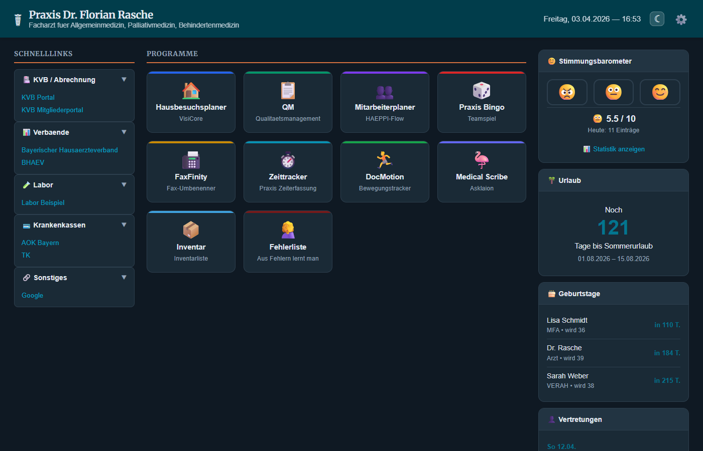

# Praxis-Startseite

Browser-Dashboard fuer die Praxis Dr. Florian Rasche — gedacht als Startseite auf allen Praxis-PCs.



## Features

**Schnelllinks** — Haeufig genutzte Seiten (KVB Portal, Laborportal, Krankenkassen, Verbaende) in aufklappbaren Kategorien.

**Programmkacheln** — Alle Praxis-Tools als grosse, uebersichtliche Kacheln in der Mitte. Ein Klick oeffnet die Anwendung.

**Stimmungsbarometer** — MFAs koennen per Smiley (rot/gelb/gruen) ihre Stimmung erfassen, optional mit Kommentar. Inklusive Kalenderansicht mit Monatsstatistik und Tagesdetails.

**Urlaubs-Countdown** — Zeigt an, wie viele Tage bis zum naechsten Urlaub verbleiben oder ob gerade Urlaub ist.

**Geburtstage** — Die naechsten drei Geburtstage im Team auf einen Blick, mit Altersangabe.

**Vertretungen** — Kommende Vertretungsregelungen mit Datum, Kollegenname und Kontaktinfos.

**Dark Mode** — Umschaltbar per Klick im Header.

## Technik

- **Backend:** Node.js + Express
- **Frontend:** Vanilla HTML/CSS/JS (kein Framework)
- **Daten:** JSON-Dateien mit automatischem Backup-System
- **Admin:** Passwortgeschuetzter Admin-Bereich zum Verwalten aller Inhalte

## Installation

```bash
npm install
npm start
```

Die Startseite ist dann erreichbar unter `http://localhost:7847`, der Admin-Bereich unter `http://localhost:7847/admin.html`.

## Lizenz

MIT
